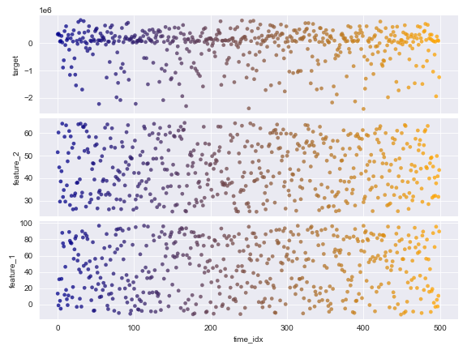
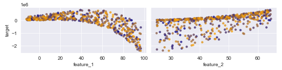
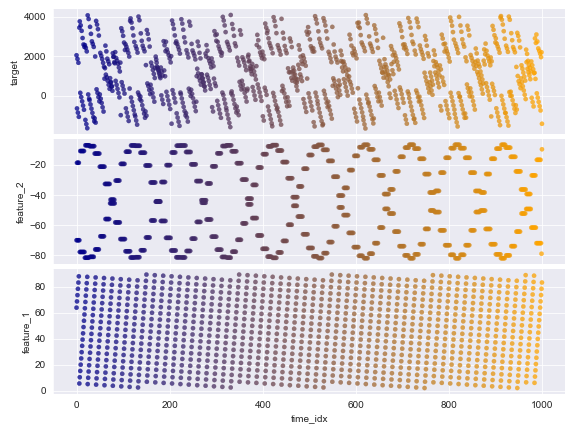
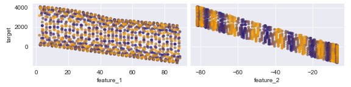
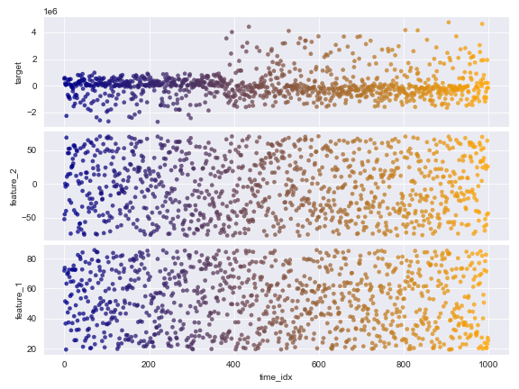
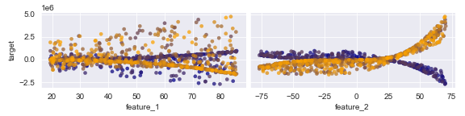

# SiD2ReGenerator

This package was developed to provide benchmark data for datadrift detection methods.
Therefore, it is mostly concerned with generating data and the underlying concept and data shift ground truths used to evaluate the detection methods.

The main interface of the package is the class: DataGeneratorGraph, therefore the initialization and main methods will be explained here.
# Benchmarks

For local generation of the SiD2Re benchmarks refer to the functions generate_benchmark_* found under sid2re.benchmarks.

- benchmark_v1: Initial benchmark associated with the original publication (10.1109/INDIN51400.2023.10218255). Selected number of seeds, that produce interpretable concepts. Limited to low dimensionality datasets.
- benchmark_v2: Benchmark with reworked graph based generation backend, that focuses on the variation of one particular concept (consistent seed). Suitable for ablation studies. Includes datasets with up to 20 dimensions.
# Examples
For visualization the following script is used:
```python
def plot_data(data):
    data = data.rename(columns={"0_0": "feature_1", "0_1": "feature_2", "O_0": "target"})
    # Get concept information
    time_stamps = data["time_idx"].values
    # Plot the generated data
    plot = sns.pairplot(data, height=2, aspect=4,
                        plot_kws=dict(hue=time_stamps, palette="blend:darkblue,orange", edgecolor=None,
                                      size=0.1, alpha=0.75),
                        diag_kind='kde', x_vars=["time_idx"], y_vars=["target", "feature_2", "feature_1"])
    plot = sns.pairplot(data, height=2, aspect=2,
                        plot_kws=dict(hue=time_stamps, palette="blend:darkblue,orange", edgecolor=None,
                                      size=0.1, alpha=0.75),
                        diag_kind='kde', x_vars=["feature_1", "feature_2"], y_vars=["target"])
```
## Simple 2D Dataset: Uniform Features without Drifts
```python
generator = DataGeneratorGraph(number_of_features=np.array([2]),
                               root_distros=[2, 0, 0, 0],
                               number_of_outputs=1,
                               n_target_dep=2,
                               number_of_data_points=500,
                               rand_seed=4)
# Generate data
data = generator.get_data()
plot_data(data)
```




## Periodical 2D Dataset (Continuous time)
```python
generator = DataGeneratorGraph(number_of_features=np.array([2]),
                               root_distros=[0, 0, 0, 2],
                               number_of_outputs=1,
                               n_target_dep=2,
                               number_of_data_points=1000,
                               continuous_time=True,
                               rand_seed=3)

data = generator.get_data()

plot_data(data)
```





## Concept Drift 

```python
generator = DataGeneratorGraph(number_of_features=np.array([2]),
                               root_distros=[2, 0, 0, 0],
                               number_of_outputs=1,
                               n_target_dep=2,
                               concept_drifts=1,
                               number_of_data_points=1000,
                               continuous_time=True,
                               rand_seed=6)

data = generator.get_data()
concept_info, data_drift_info =generator.get_shift_information()
print(concept_info)
plot_data(data)
```
Output:
```
    time_stamp(centre)      radius                                               shift    class 
0           630.866645  250.245898   [-178.57203028720033, -66.39596106023545, -164...   sudden

```






