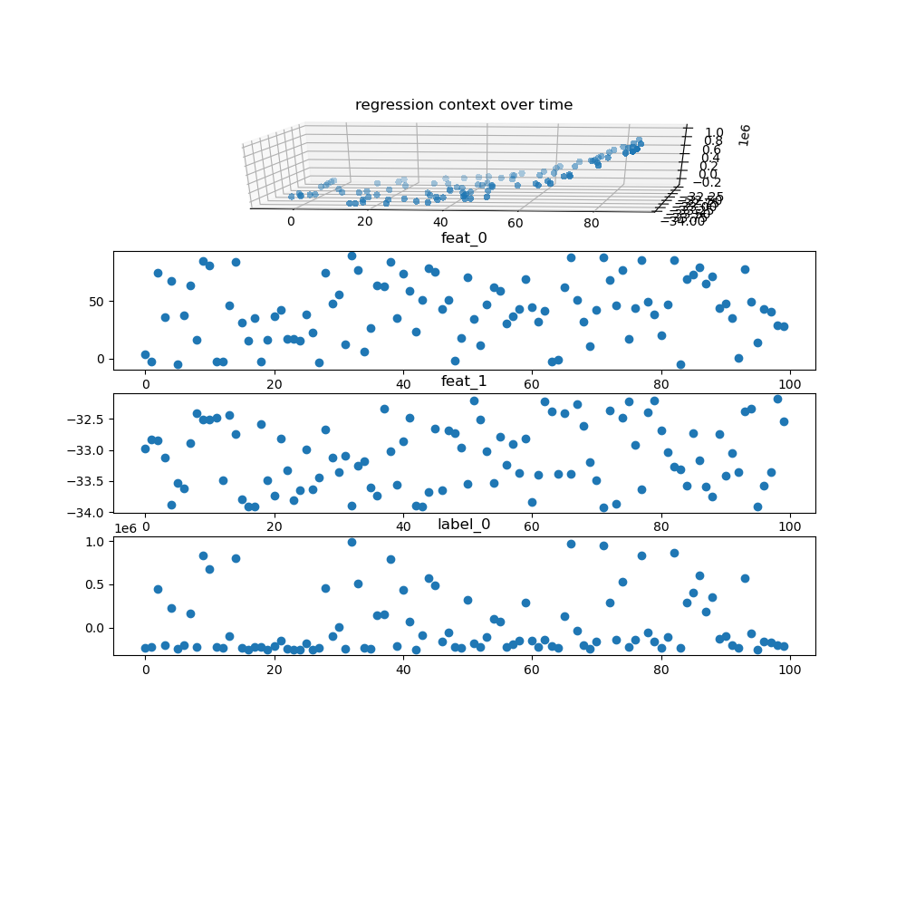
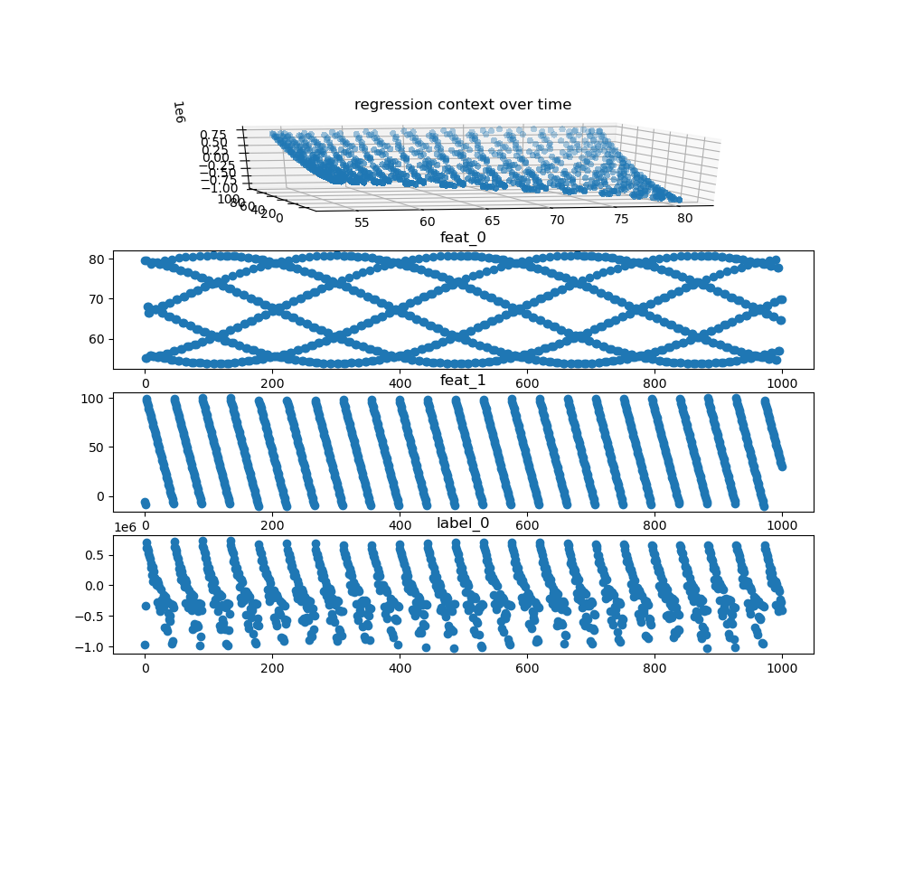
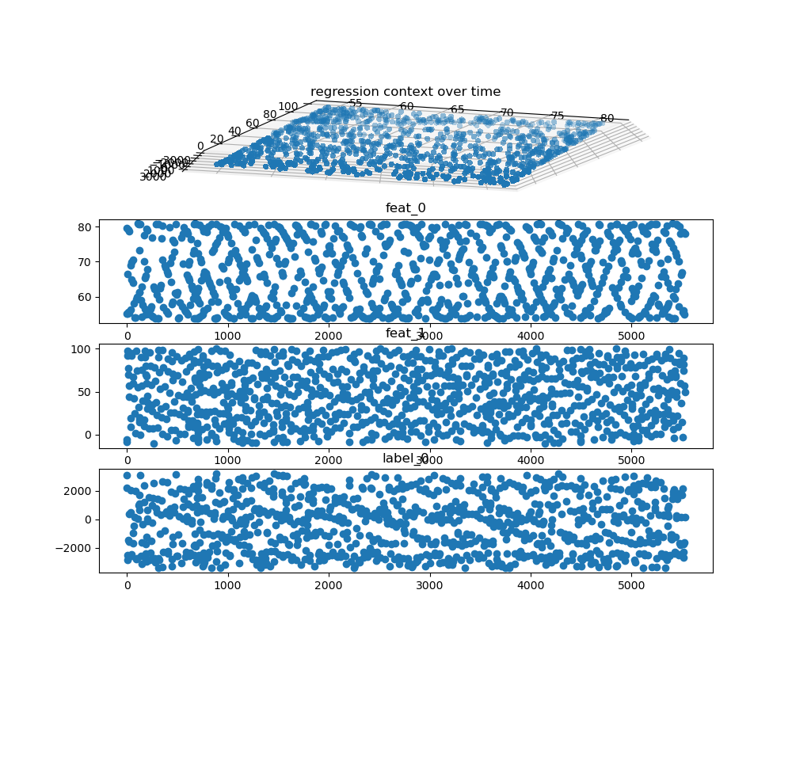
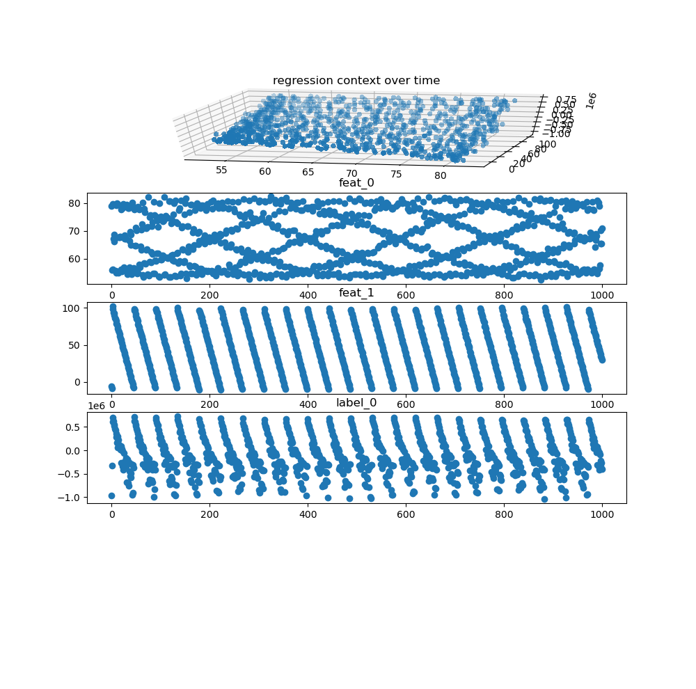
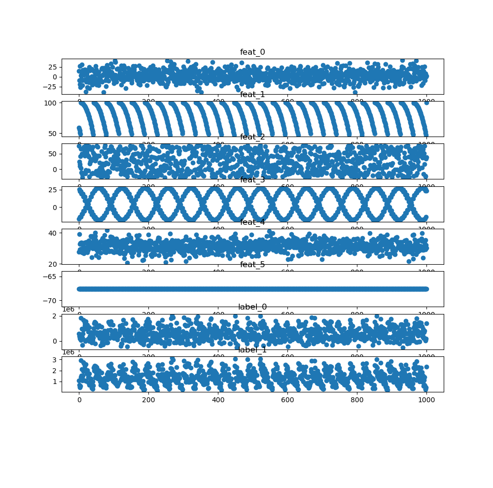
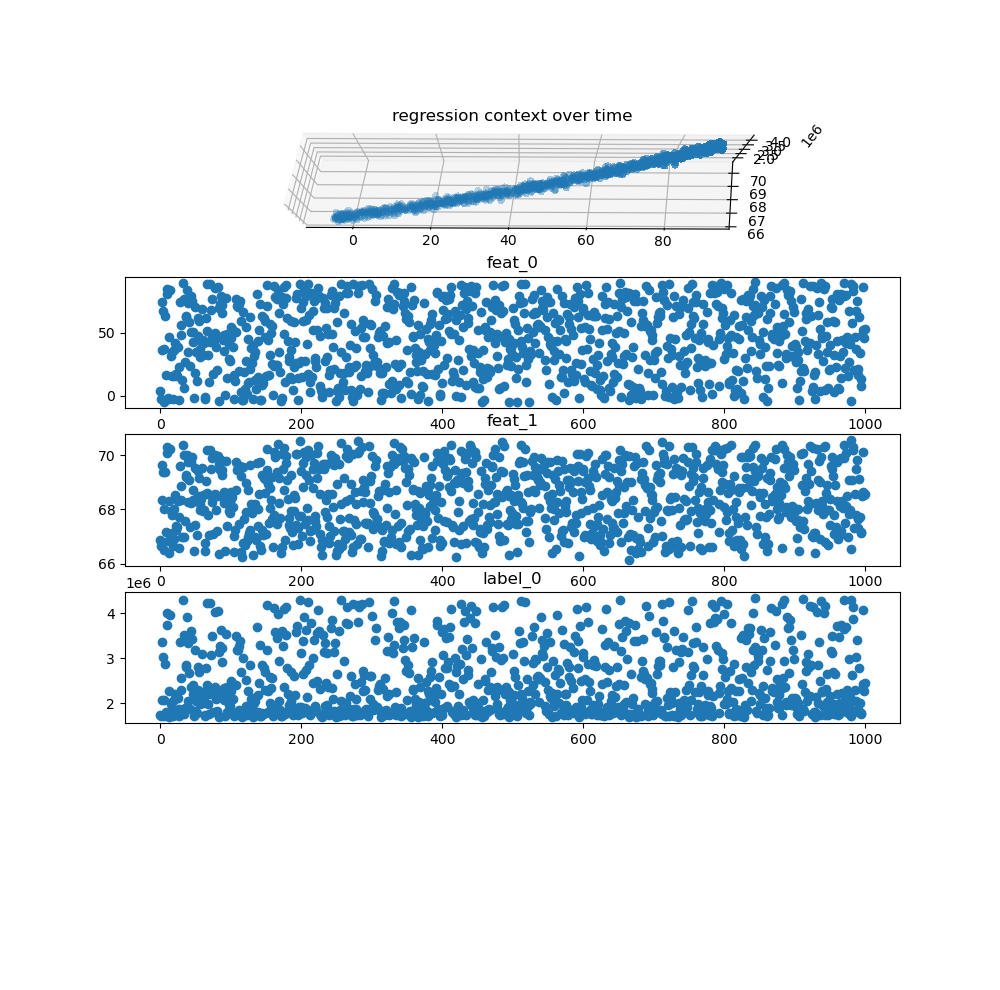
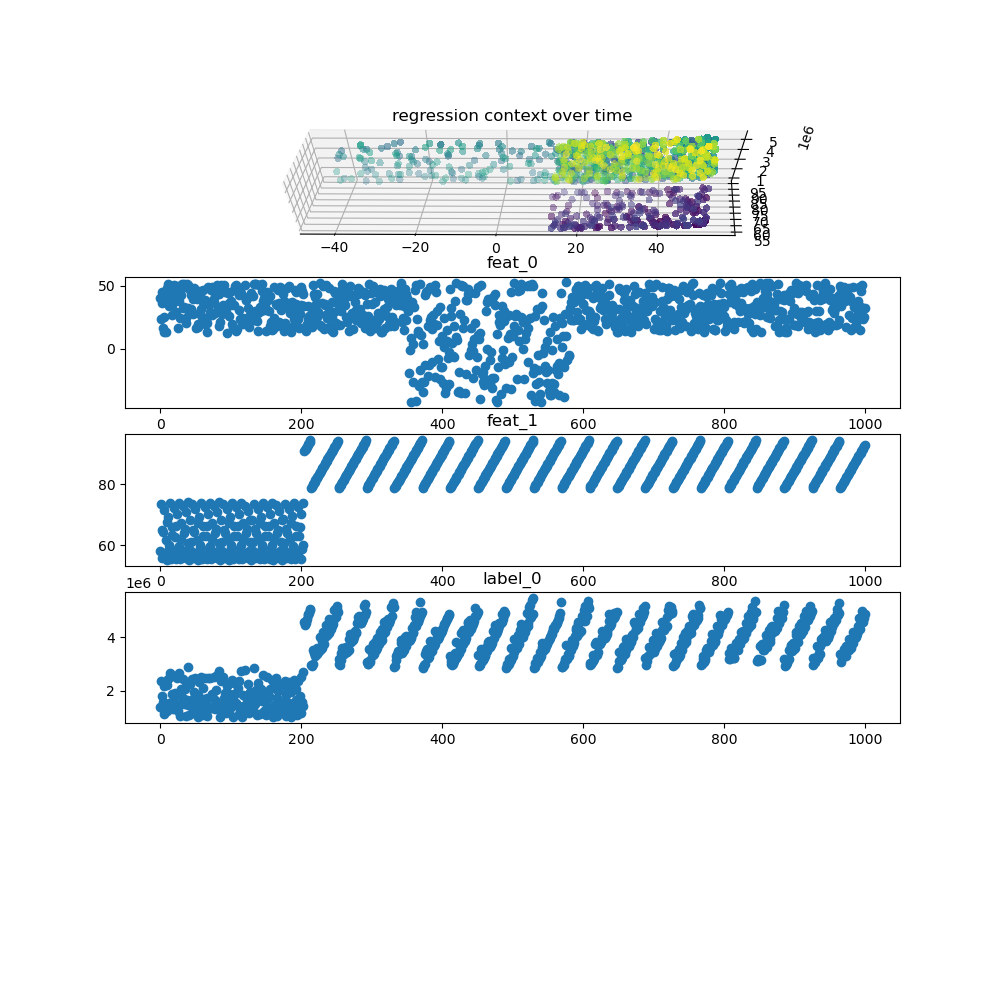
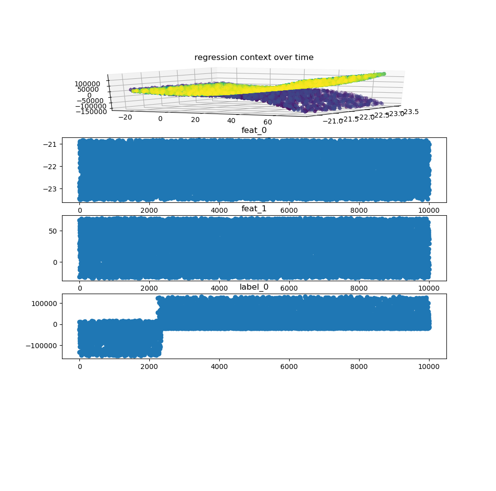

# SiD2ReGenerator

This package was developed to provide benchmark data for datadrift detection methods.
Therefore it is mostly concerned with generating data and the underlying concept and data shift groundtruths used to evaluate the detection methods.

To use and setup this package you will need to use the collection of modules provided as a anaconda environment in the environment.yml.

The main interface of the package is the class: DataGenerator, therefore the initialization and main methods will be explained here.

[driftbenchmark.generator.DataGenerator](#driftbenchmark.generator.DataGenerator)

[driftbenchmark.generator.DataGenerator.get_data()](#driftbenchmark.generator.DataGenerator.get_data())

[driftbenchmark.generator.DataGenerator.get_shift_information()](#driftbenchmark.generator.DataGenerator.get_shift_information())

[driftbenchmark.utils.plot()](#driftbenchmark.utils.plot())

[driftbenchmark.generator.DataGenerator.get_context()](#driftbenchmark.generator.DataGenerator.get_context())

[context.regression_context.RegressionContextModel](#context.regression_context.RegressionContextModel)

[Examples](#Examples)
## driftbenchmark.generator.DataGenerator
**DataGenerator(number_of_data_points, number_of_models, number_of_features, number_of_outputs, feature_min, feature_max, noise_var, rand_seed, concept_drifts, data_drifts,correlation_drifts, continous_time=True, max_time_sparsity)**

Gives back a DataGenerator Object, that is used for all Benchmark Dataset synthesis tasks.

Parameters: 
* number_of_data_points: int, default=100

>number of samples that will be generated when using the DataGenerator-Object
* param number_of_models: int, defalut=5

>number of models used to build the underlying context function that maps features to outputs. The context is build by a weighted sum of different randomly build regression models. Each model can be one of {Multi Layer Perceptron Regressor; Kernel Ridge Regressor; Decision Tree Regressor}.
>
>>The regression context is defined as a function F:R^n->R^m where F(x)=a_1\*f_1(x)+a_2\*f_2(x)+a_3\*f_3(x)+....
* param number_of_features: int, default=2

>dimensionality n of the input used for the underlying regression function
* param number_of_outputs: int, default=1

>dimensionality m of the outputs of the underlying regression function
* param feature_min:float *(wip:np.array to set min value for each feature individually)*, default = -100
>minimal value allowed for generated features, does not limit value space of the labels/outputs
* param feature_max:float *(wip:np.array to set min value for each feature individually)*, default = 100
>maximal value allowed for generated features, does not limit value space of the labels/outputs
* param noise_var:float, default = 0
>variance for the normal distribution, that is used to add noise to features AND labels.
>Important: labels are first generated with the regression context, then noise is added to feature values and label values independently.
* param rand_seed:int, defalut = -1
>seed that is gloably set for all suboperations that use random number generators. Used for reproducability.
>If set to -1 the seed will not be set specificaly, but the random number generators will be initialized with the current system time.
* param concept_drifts:int *(wip:list [{"centre","radius","shift","class"}] to set drift characteristics manually)*, default=0
>number of concept drifts that are to be intrudced over time into the regression context. Realized by changing the weights of the weighted sum, that represents the underlying model function
* param data_drifts:int *(wip:list [{"centre","radius","shift","class","feature_idx"}] to set drift characteristics manually)*, default=0
>number of data drifts that are to be introduced over time. Realized by  changing feature distribution defining vector, leading to changes in for example variance, centre and amplitude of respective distributions
* param correlation_drifts:*(wip)*
* param continous_time:bool, default = true
>If **True**: samples are drawn for continous points in time
>If **False**: samples are drawn for irregular points in time, where between two points there may be up to **max_time_sparsity** samples missing
* param max_time_sparsity: int, default = 10 
>Only used if **continous_time** is **False**.
>Determines the maximal span of time that may lay between two samples. Relevant if periodical features are used

## driftbenchmark.generator.DataGenerator.get_data()
**get_data(n_uniform_feat, n_gauss_feat, n_constant_feat, n_periodical_feat,correlated_features)**

Used for actually generating all feature values and labels, as initialized under **DataGenerator()**.
>if the number of statically set feature distributions is smaller then the overall feature count, the remaining features are assigned distributions by random
* param n_uniform_feat: int, default = 0
>min number of features that should have a uniform behaviour arround a random centre value and random radius interval
* param n_gauss_feat: int, default = 0
>min number of features that should have a gaussian behaviour arround a random centre value and random variance
* param n_constant_feat: int, default = 0
>min number of features that should have a constant behaviour arround a random centre value
* param n_periodical_feat: int, default = 0
>min number of features that should have a periodical behaviour arround a random centre, random amplitude and random interval for a randomly choosen periodical function:{cosine,quadratic_cut,linear_cut}
* param correlated_features: int, default = 0
>number of features that should be linearly correlated with each other. Which features get correlated is choosen randomly.
* **return:** pandas.DataFrame()
> DataFrame holding the used "Time_stamps", "Features" and "Labels"

## driftbenchmark.generator.DataGenerator.get_shift_information()
**get_shift_information()**

Used to get the ground truth data behind the data and concept drifts.

* **return:** (**concept**: pandas.DataFrame(), **data**: pandas.DataFrame())
> concept: [time_stamp(centre), radius, shift, class]
>
>data: [time_stamp(centre), affected_feature, radius, shift of distribution parameters, class]
## driftbenchmark.utils.display_data()
**display_data(data, generator,time_vis)**

* param data: pd.DataFrame(), columns = ['time_stamp','feat_0',...,'feat_n','label_0',...,'label_m']
>Data to display in visualizations
* param generator: DataGenerator, default = None
>If **None** no drift information will be displayed
* param time_vis: bool, default = False
>If **True** displays  time realted colors where applicable. Should be used for concept drifts.

## driftbenchmark.generator.DataGenerator.get_context()
## context.regression_context.RegressionContextModel
# Examples
## Simple 2D Dataset: Uniform Features without Drifts
        generator = DataGenerator(number_of_features=2, number_of_outputs=1, number_of_data_points=100, rand_seed=1)

        data = generator.get_data(n_uniform_feat=2)

        display_data(data, generator)

## Periodical 2D Dataset (Continous time)
        generator = DataGenerator(number_of_features=2, number_of_outputs=1, number_of_data_points=1000, continous_time=True, rand_seed=2)

        data = generator.get_data(n_periodical_feat=2)

        display_data(data, generator,time_vis=False)

## Noisy Periodical 2D Dataset (No Continous time; Not recommended)
        generator = DataGenerator(number_of_features=2, number_of_outputs=1, number_of_data_points=1000, continous_time=False, rand_seed=2)

        data = generator.get_data(n_periodical_feat=2)

        display_data(data, generator,time_vis=False)

## Noisy Periodical 2D Dataset (Continous time with Noise)
        generator = DataGenerator(number_of_features=2, number_of_outputs=1, noise_var=0.01, number_of_data_points=1000, continous_time=True, rand_seed=2)

        data = generator.get_data(n_periodical_feat=2)

        display_data(data, generator,time_vis=False)

## Complex Dataset:R^6->R^2 (Tends to require more models to build "interessting" regression context)

                generator = DataGenerator(number_of_models=10,number_of_features=6, number_of_outputs=2,number_of_data_points=1000,continous_time=True, rand_seed=2)

        data = generator.get_data(n_uniform_feat=1, n_gauss_feat=2, n_constant_feat=1, n_periodical_feat=2)

        display_data(data, generator,time_vis=False)

## Correlated 2D Dataset
        generator = DataGenerator(number_of_features=2, number_of_outputs=1, number_of_data_points=1000,continous_time=True, rand_seed=1)

        data = generator.get_data(n_uniform_feat=1, n_gauss_feat=1, correlated_features=2)

        display_data(data, generator,time_vis=False)

## Data Drift 

        generator = DataGenerator(number_of_features=2, number_of_outputs=1,data_drifts=2, number_of_data_points=1000,continous_time=True, rand_seed=1)

        data = generator.get_data(n_uniform_feat=1, n_periodical_feat=1)

        display_data(data, generator,time_vis=True)
Output:

           time_stamp(centre)  ...               class
        0          466.413143  ...  reoccuring_concept
        1          344.826879  ...              sudden

## Concept Drift 

        generator = DataGenerator(number_of_models=10,number_of_features=2, number_of_outputs=1,concept_drifts=1, number_of_data_points=2000,continous_time=True, rand_seed=5)

        data = generator.get_data(n_uniform_feat=2)

        display_data(data, generator,time_vis=True)
Output

           time_stamp(centre)  ...    class
        0         2219.709718  ...  gradual

